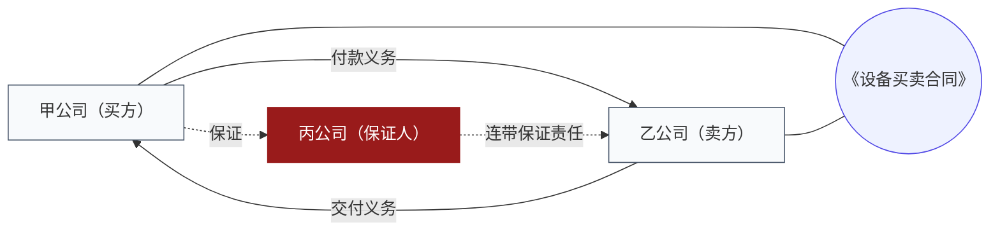

# 法律关系图

> 定位：讲清**谁和谁、就什么东西、发生什么关系**。用于主体多、多层转手、担保与关联交易的案子。

## 一、这张图要回答的三个问题

1. **主体**：有哪些人 / 公司，各自身份是什么（合同当事人、担保人、实际施工人、关联公司、股东……）；
2. **客体**：关系指向什么——哪份合同、哪笔款项、哪处房产、哪批货物；
3. **关系**：主体之间是什么法律关系（买卖、借款、担保、委托、股权、挂靠……），方向如何。

主体与客体要**同时存在**：只画主体看不出在争什么，只画客体看不出谁来承担。

## 二、画法约定

### 形状

| 元素 | 形状 | 说明 |
|------|------|------|
| 自然人 / 法人 | 矩形 | 主体 |
| 合同、标的物、款项 | 圆角矩形或圆柱 | 客体 |
| 争议焦点所在 | 深红描边或实底 | 见"要害标注" |

### 连线

- 箭头方向 = 义务或权利的流向（谁向谁承担）；
- 线上必须写关系名称，不能只有一根线；
- 双向关系画两根线，或明确在线上标注双向，不要用一根线表示双向（很容易被看成单向）。

## 三、要害标注（克制）

用深红（`#991B1B`）标出**最要紧的一两处**，例如：

- 争议的核心合同；
- 责任承担的关键主体；
- 我方请求权指向的那一层关系。

**至多两处**。三处以上改为在图下说明"本图共有 N 处要害，分别在……"，图上不再用深红。

## 四、Mermaid 模板



**画不下时**：主体超过 9 个，按"争议涉及的层级"拆成两张图（例如交易关系图 + 担保关系图），并说明拆图依据。

## 五、必须附的说明

图下方三行说明，缺一不可：

```
关系依据：每层关系对应的合同/判决名称（逐条列明）
未确认：尚不清楚或存在争议的关系（逐条列明）
范围：本图只反映截至 YYYY-MM-DD 的关系状态
```

## 六、常见错误

| 错误 | 后果 |
|------|------|
| 只有线、没有关系名称 | 看不出是买卖还是借款 |
| 主体与客体不做区分 | 分不清"谁欠谁"和"欠什么" |
| 股权关系与控制关系画成同一种线 | 法律效果完全不同 |
| 多层转手只画首尾 | 中间的合同相对性被抹掉，反而误导 |
| 关系依据不逐条列明 | 对方一质疑就无从解释 |
