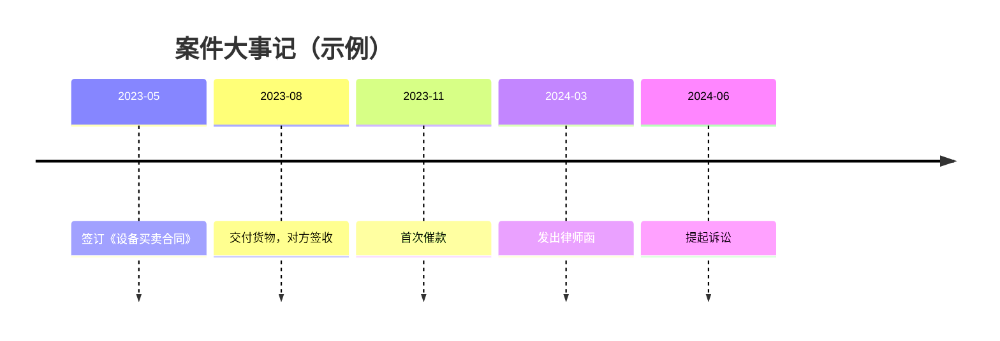
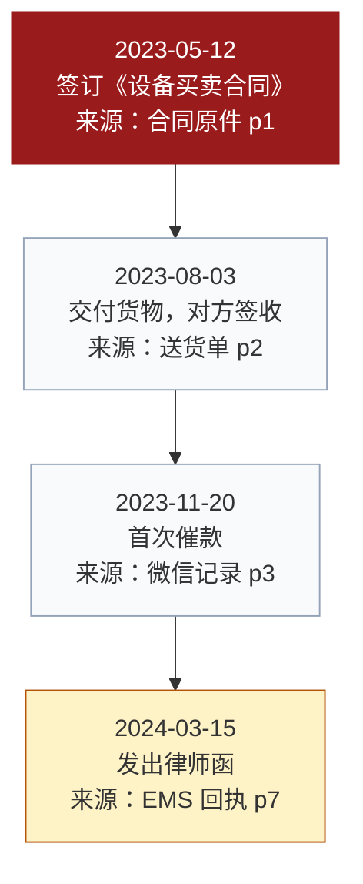

# 时间线图与大事记

> 定位：**只照录材料里已经发生的事**，不做法律判断，不给结论。判断留给对抗图。

## 一、核心规则

1. **照录原文**：事件描述用材料的原话或紧贴原话的短语，不改写、不归纳；
2. **每行挂出处**：材料名称 + 页码 / 案号 / 时间戳；
3. **不作法律判断**：不写"构成违约""已过诉讼时效"这类结论；事实与评价分层是这张图的底线；
4. **缺就留空**：日期不明、金额不明，写"日期不明"并注明依据，不猜。

## 二、字段

| 序号 | 日期 | 事件（照录） | 来源 | 重要性 | 备注 |
|------|------|--------------|------|--------|------|
| 1 | 2023-05-12 | 双方签订《设备买卖合同》 | 合同原件 p1 | 🔴 | 起算点 |

**重要性标记**（只用三档，避免满图都是重点）：

| 标记 | 含义 |
|------|------|
| 🔴 | 关键节点：权利义务起算、违约发生、催告、解除、诉讼时效相关 |
| 🟡 | 重要：影响事实认定但不改变法律关系 |
| ⚪ | 背景：用于说明来龙去脉 |

## 三、排序规则（必须写明）

- 主排序：按日期先后；
- **同一天有多个事件**：时间点明确（有具体时刻）的排在前面；无时刻的按材料中的出现顺序；
- **日期只到月或年的**（如"2023年6月前后"）：不塞进日级序列，单独成组放在该时段的末尾，并标注"日期不精确"；
- **日期存在冲突**（不同材料写法不一致）：两个日期都保留，标注冲突与各自出处，**不要自行选一个**。

排序规则要在图或表的下方注明一行，否则看图的人无法判断并列事件的处理是否合理。

## 四、Mermaid 模板

### 紧凑版（事件少、只讲顺序）

### 可控版（需要标出处与重要性）

**配色克制**：深红（`#991B1B`）只用于关键节点，全图**至多两处**；超过两处改用黄色或加粗，不要满图红。

## 五、大事记表（Word / Excel 交付版）

图之外同时出一张表，供插入文书或打印：

| 序号 | 日期 | 事件 | 来源 | 重要性 |
|------|------|------|------|--------|

表与图必须来自同一份数据（同一份 JSON 或同一张母表），不要分别手工维护。

## 六、常见错误

| 错误 | 后果 |
|------|------|
| 把"对方恶意拖欠"这类评价写进事件栏 | 事实与评价混层，图失去证明力 |
| 日期冲突时自行选一个 | 一旦被核对，全图可信度受损 |
| 同日事件不写排序规则 | 看图的人无法判断顺序是否有意安排 |
| 扫描件提取的事件不声明 | 与原件不符时无法解释 |
| 关键节点标了五处 | 视觉上等于没标 |
