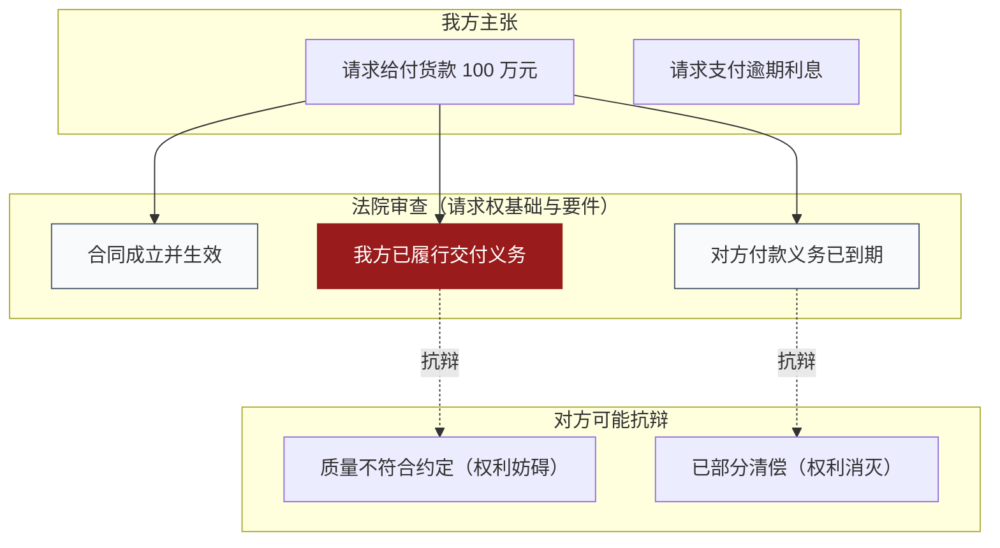

# 庭前对抗图

> 定位：庭前推演用。把"我方主张什么、法院审什么、对方怎么应、哪一处是决定性的"排在一张图上。
> **默认不外传**——这张图包含判断与策略，属于内部材料。

## 一、结构：三列

```
左：提出请求的一方        中：法院审查                 右：抗辩的一方
（诉讼请求 / 主张）      （请求权基础 + 构成要件）      （抗辩 / 反驳）
```

中间列从**请求权基础**出发拆要件，而不是从当事人说了什么出发列清单。

## 二、中间列的构件

逐要件列出，每项带三样东西：

| 要件 | 法院审查标准 | 我方证据 | 法律置信 | 证据置信 | 来源 |
|------|--------------|----------|----------|----------|------|

- **法律置信**：该要件的法律构成是否清楚、有无争议；
- **证据置信**：现有证据能否支持；
- **来源**：依据哪份材料或哪条法律规定。

两栏置信**分开评，不要合成一个分数**——"法律清楚但证据不足"和"证据充分但定性有争议"的处置方式完全不同。

## 三、右列：抗辩分类

按抗辩类型归类，而不是把对方可能说的话堆在一起：

| 类型 | 说明 | 举例 |
|------|------|------|
| 权利未发生 | 否认请求权成立 | 合同未成立、未生效 |
| 权利消灭 | 承认成立但已消灭 | 已清偿、抵销、免除 |
| 权利妨碍 | 主张权利不能行使 | 时效抗辩、履行抗辩权 |
| 程序性抗辩 | 与实体无关 | 管辖异议、主体不适格 |

每一类下写明：对方论点、我方预备的回应、回应的证据支撑。

## 四、决定性要件怎么标

- 深红（`#991B1B`）只标**决定性要件**及其走线；
- 全图**至多两处**；三处及以上，图上不用深红，改为在图下写明"本案有三处决定性要件，分别是……"，或拆成两张图；
- 图例必须写明定义：**决定性要件 = 该要件成立与否直接决定胜负**。

## 五、Mermaid 模板



图例写明：深红 = 决定性要件；虚线 = 抗辩指向。

## 六、结论留空

以下内容**只给方向、不下结论**，留给律师填：

- 证明前景（哪一方更可能被采信）；
- 胜负预测；
- 法院可能另行认定的案由或法律关系。

确实需要写时，写成"待律师确认"并在图上留出位置。

## 七、出示范围

| 对象 | 给什么 |
|------|--------|
| 律师团队 | 全图 |
| 当事人 | 删去策略与胜负判断的**事实版**（保留请求、要件、抗辩类型） |
| 法院、对方 | **不给**。需要时另出"法律关系图 + 事实时间线"的客观版本 |

## 八、常见错误

| 错误 | 后果 |
|------|------|
| 把对抗图提交给法院 | 暴露争点预判与策略 |
| 三列里混入胜负结论 | 内部推演被当成正式意见 |
| 只列要件、不标置信 | 看不出哪一项最薄弱 |
| 抗辩不分类型堆在一起 | 无法对应到具体应对策略 |
| 深红标了四五处 | 决定性要件失去区分度 |
